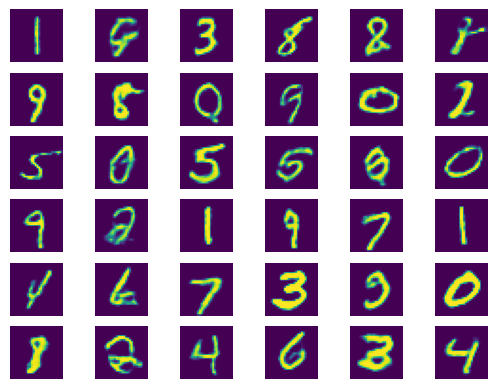

# WGAN
My implementation of Wasserstein GAN Based on paper [Improved Training of Wasserstein GANs](https://arxiv.org/pdf/1704.00028v3.pdf). Architecture for neural network for anime faces taken from: https://github.com/igul222/improved_wgan_training and rewritten to Tensorflow 2.

## Example on training on MNIST dataset

## Example on training on anime portraits (scaled to 64x64)

Dataset: https://gwern.net/crop#danbooru2019-portraits

